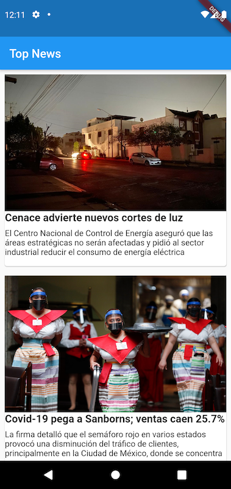
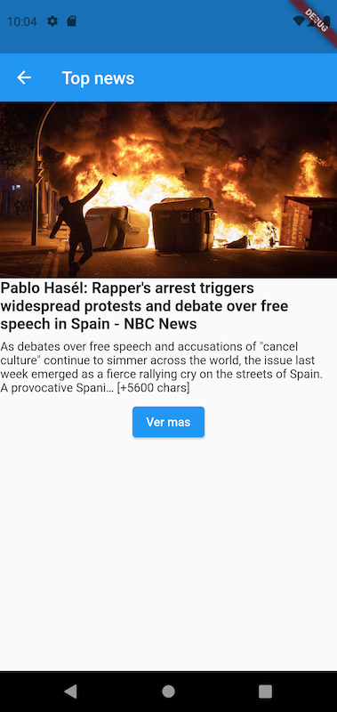
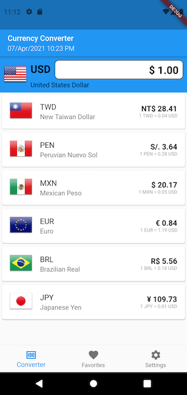
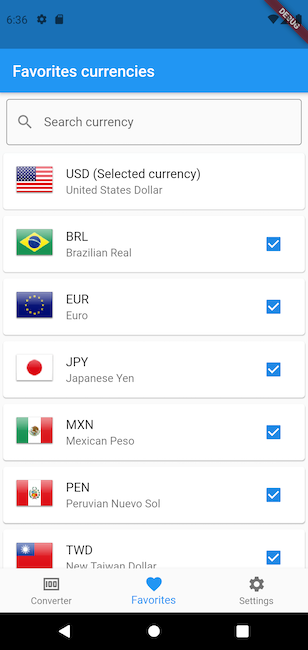
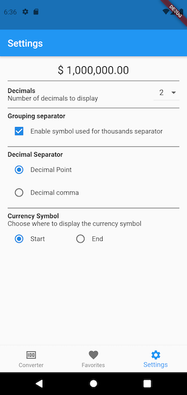
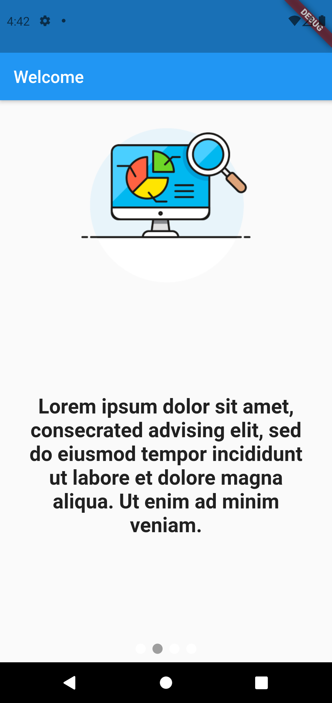
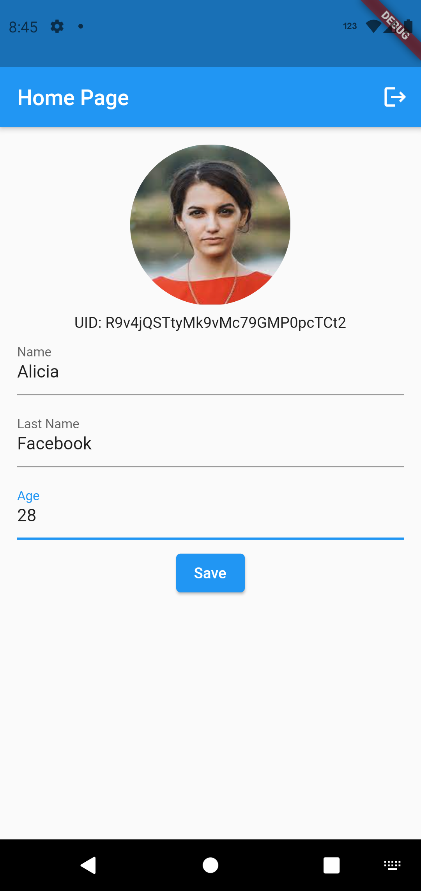
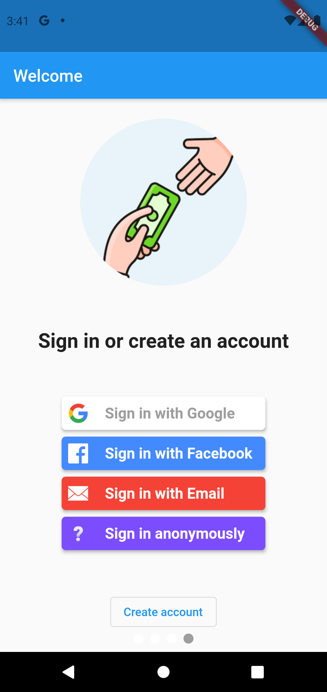
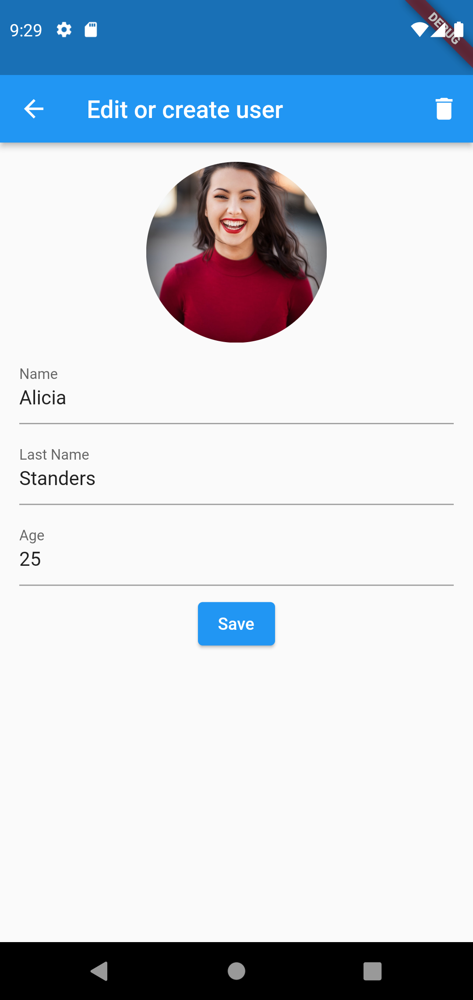

# Flutter Example Compilation

This is a compilation of Flutter projects that I used for my tutorials on my [YouTube channel](https://www.youtube.com/channel/UC9WSk7SkAXLJkT6NLg1p2cA) or my [Blog](https://www.yayocode.com/).

## State Management
### [Cubit][5010]

|                                                                                                                                                                                                                                                                         |                                                                                                                                                                                                                                                           |
|-------------------------------------------------------------------------------------------------------------------------------------------------------------------------------------------------------------------------------------------------------------------------|-----------------------------------------------------------------------------------------------------------------------------------------------------------------------------------------------------------------------------------------------------------|
| [Get the source code][1] - Repository Pattern - Rest API using [http][5000] - Cubit tests - Widget Test - [http][5000] request test                                                                                                                 |                                                                                                                                                                        |
| [Get the source code][2] - Repository Pattern - Rest API using [http][5000] - Cubit tests - Widget Test - [http][5000] request test                                                                                                                 |                                |
| [Get the source code][3] - Repository Pattern - Rest API using [http][5000] - Local Database with [Sqflite][5002] - Internationalization with [Easy Localization][5003] - Cubit tests - Widget Test - [http][5000] request test             |              |
| [Get the source code][4] - [Firebase Authentication][5004] - Online & Offline Database [Firebase Firestore][5006] - Store files on [Firebase Storage][5005]                                                                                             |        |
| [Get the source code][5] - CRUD with Firebase - Dependency Injection with [GetIt][5008] - Login with [FlutterFire UI][5007] - Online & Offline Database [Firebase Firestore][5006] - Store files on [Firebase Storage][5005] - Cubit tests  |     |
| [Get the source code][6] - Dependency Injection with [GetIt][5008] - Rest API using [http][5000] - Local Database with [Sqflite][5002] - Cubit tests - Widget Test - [http][5000] request test                                                  |                                                                                                                                                         |
| [Get the source code][7] - Dependency Injection with [GetIt][5008] - Rest API using [http][5000] - Cubit tests - Widget Test - [http][5000] request test                                                                                            |                                                                                               |

### [GetX][5009]

|                                                                                                                                                                                                                                                                          |                                                                                                                                                                                                                                                        |
|--------------------------------------------------------------------------------------------------------------------------------------------------------------------------------------------------------------------------------------------------------------------------|--------------------------------------------------------------------------------------------------------------------------------------------------------------------------------------------------------------------------------------------------------|
| [Get the source code][8] - [Firebase Authentication][5004] - Online & Offline Database [Firebase Firestore][5006] - Store files on [Firebase Storage][5005]                                                                                              |     |
| [Get the source code][9] - CRUD with Firebase - Dependency Injection with [GetIt][5008] - Login with [FlutterFire UI][5007] - Online & Offline Database [Firebase Firestore][5006] - Store files on [Firebase Storage][5005] - Widget tests  |     |
| [Get the source code][6] - Dependency Injection with [GetX][5009] - Rest API using [http][5000] - Local Database with [Sqflite][5002] - GetX controller tests - Widget tests - [http][5000] request test                                         |                                                                                                                                                                           |

## Tips

|                                                                                                   |                                                                                     |
|---------------------------------------------------------------------------------------------------|-------------------------------------------------------------------------------------|
| [Get the source code][11] Google Chrome extension with Flutter                                |            |
| [Get the source code][12] Show your users when they  do not have internet connection  |  |
| [Get the source code][13] Internationalization your Flutter app in a few easy steps   |  |
| [Get the source code][14] Learn Flutter Hooks and remove repetitive code                  |              |

[1]: <https://github.com/Yayo-Arellano/flutter_examples_compilation/tree/main/best_architecture_challenge_taiwan> 'best_architecture_challenge_taiwan'
[2]: <https://github.com/Yayo-Arellano/flutter_examples_compilation/tree/main/flutter_bloc_architecture> 'flutter_bloc_architecture'
[3]: <https://github.com/Yayo-Arellano/flutter_examples_compilation/tree/main/flutter_currency_converter_bloc> 'flutter_currency_converter_bloc'
[4]: <https://github.com/Yayo-Arellano/flutter_examples_compilation/tree/main/flutter_simple_firebase_auth_bloc> 'flutter_simple_firebase_auth_bloc'
[5]: <https://github.com/Yayo-Arellano/flutter_examples_compilation/tree/main/flutter_simple_firebase_crud_cubit> 'flutter_simple_firebase_crud_cubit'
[6]: <https://github.com/Yayo-Arellano/flutter_examples_compilation/tree/main/flutter_simple_rest_api_getx_migrate_flutter_bloc> 'flutter_simple_rest_api_getx_migrate_flutter_bloc'
[7]: <https://github.com/Yayo-Arellano/flutter_examples_compilation/tree/main/simple_news_app_flutter_taipei> 'simple_news_app_flutter_taipei'
[8]: <https://github.com/Yayo-Arellano/flutter_examples_compilation/tree/main/flutter_simple_firebase_auth_getx> 'flutter_simple_firebase_auth_getx'
[9]: <https://github.com/Yayo-Arellano/flutter_examples_compilation/tree/main/flutter_simple_firebase_crud_getx> 'flutter_simple_firebase_crud_getx'
[10]: <https://github.com/Yayo-Arellano/flutter_examples_compilation/tree/main/flutter_simple_rest_api_getx> 'flutter_simple_rest_api_getx'
[11]: <https://github.com/Yayo-Arellano/flutter_examples_compilation/tree/main/flutter_chrome_extension> 'flutter_chrome_extension'
[12]: <https://github.com/Yayo-Arellano/flutter_examples_compilation/tree/main/flutter_connectivity_plus_tutorial> 'flutter_connectivity_plus_tutorial'
[13]: <https://github.com/Yayo-Arellano/flutter_examples_compilation/tree/main/flutter_easy_localization_tutorial> 'flutter_easy_localization_tutorial'
[14]: <https://github.com/Yayo-Arellano/flutter_examples_compilation/tree/main/flutter_hooks_tutorial> 'flutter_hooks_tutorial'

[5000]: <https://pub.dev/packages/http> 'Package: http'
[5001]: <https://pub.dev/packages/mockito> 'Package: mockito'
[5002]: <https://pub.dev/packages/sqflite> 'Package: sqflite'
[5003]: <https://pub.dev/packages/easy_localization> 'Package: easy_localization'
[5004]: <https://pub.dev/packages/firebase_auth> 'Package: firebase_auth'
[5005]: <https://pub.dev/packages/firebase_storage> 'Package: firebase_storage'
[5006]: <https://pub.dev/packages/cloud_firestore> 'Package: cloud_firestore'
[5007]: <https://pub.dev/packages/flutterfire_ui> 'Package: flutterfire_ui'
[5008]: <https://pub.dev/packages/get_it> 'Package: get_it'
[5009]: <https://pub.dev/packages/get> 'Package: get'
[5010]: <https://pub.dev/packages/flutter_bloc> 'Package: flutter_bloc'