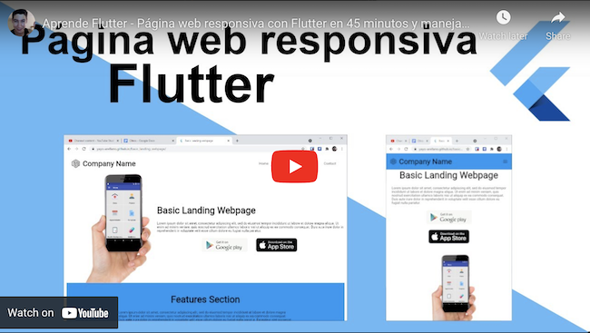
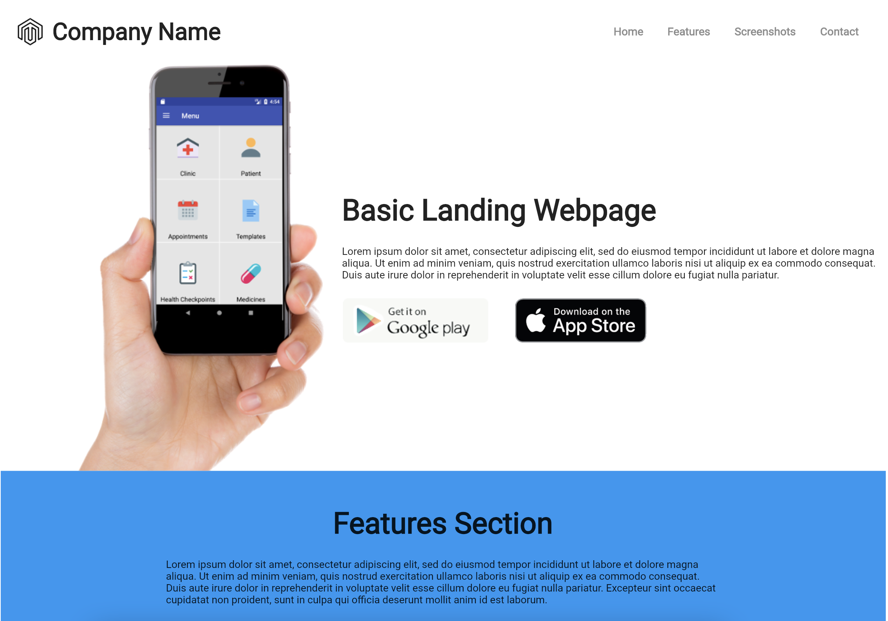

# Flutter Example: Basic landing web page

Working on Flutter Stable 3.10.0

The main purpose of this example is creating a responsive landing
website. [Website Example](https://yayo-arellano.github.io/flutter_examples_compilation/basic_landing_webpage).

State management: [Riverpod](https://pub.dev/packages/hooks_riverpod)

# Video

# Screenshots

  

