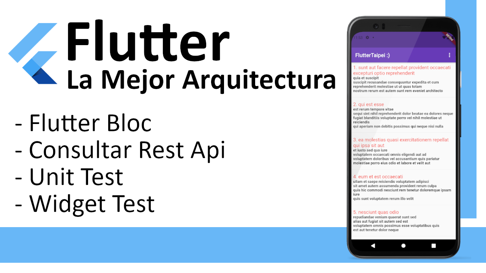

# 📢📢📢 Flutter Best Architecture Challenge 📢📢📢
此為參加 Flutter Best Architecture Challenge 活動的專案

Flutter Challenge proposed in [Facebook Flutter Taiwan](https://www.facebook.com/groups/flutter.tw/posts/824114368242152/)

Contact:
 - [Facebook](https://www.facebook.com/yayo28)
 - [LinkedIn](https://www.linkedin.com/in/yayoarellano/)

### Architecture (Flutter Bloc)

I decided to use Bloc and the architecture proposed in the [official webpage](https://bloclibrary.dev/#/architecture) of the
flutter bloc package. 

Using the bloc library allows us to separate our application into three layers:

- Presentation
- Business Logic
- Data
   - Repository
   - Data Provider
  
# Video and Blog (In spanish)
Also, I created an article in spanish in [my Blog](https://yayocode.com/2022/12/09/fluttter_challenge_the_best_architecture_taiwan/)

