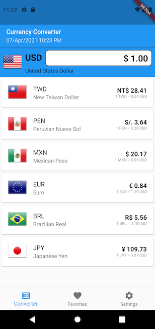
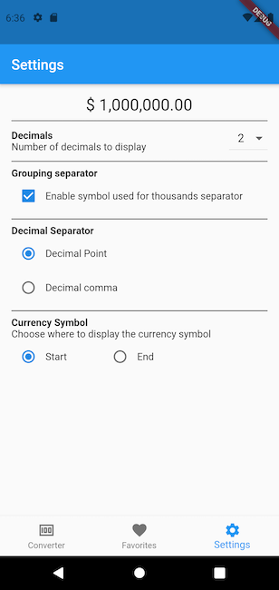

# Flutter Currency Converter

Working on flutter 3.10.0

- Learn how to use manage states using [Flutter Bloc](https://pub.dev/packages/flutter_bloc)
- Local data persistence using [SQFLite](https://pub.dev/packages/sqflite)
- Separate the app in multiple layers (presentation, business logic, data)
- Make request to a Rest API using [Http](https://pub.dev/packages/http)
- Unit test & widget test
- Handle exceptions

# Architecture


# Prerequisites

- Get an API key from [https://fixer.io/](https://fixer.io/)
- Add the API key in the `RestProvider` class

  ````
  class RestProvider {
    static const String _accessKey = '<Your API key>';
  ````

- Run the command `flutter pub run build_runner watch --delete-conflicting-outputs` to generate the code.

# Screenshots

| Converter Screen                   | Favorites Screen                   | Settings Screen                    |
|------------------------------------|------------------------------------|------------------------------------|
|  |  |  |

