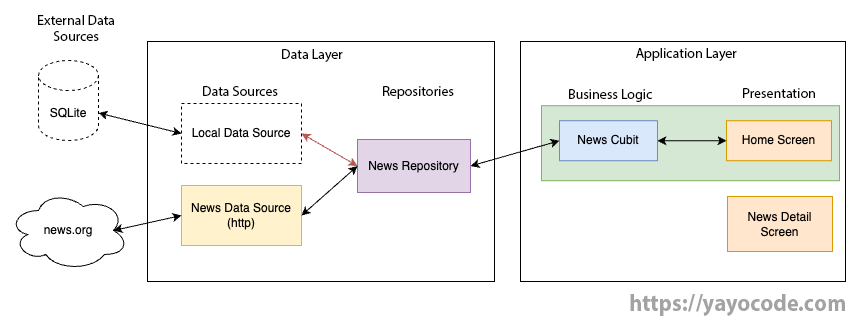
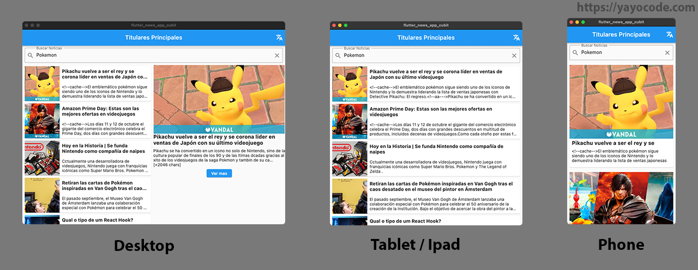

# Cubit in Practice: Creating a Responsive News Application with Multi-Language Support

- Create a responsive app with support for small, medium, and large devices.
- Learn to use [cubit][cubit] as a state management solution.
- Build a simple, scalable architecture that allows for testing.
- Learn how to add unit and widget tests to our project.
- Make REST API requests using [http][http].
- Apply dependency injection with [GetIt][getIt] (not to be confused with GetX).

## Tutorials (spanish)

- [Part 1: Introduction, Architecture, and Data Sources.][parte1]
- [Part 2: Dependency Injection, Repositories, and Business Logic.][parte2]
- [Part 3: Presentation Layer and Multi-Language Support.][parte3]

## Architecture

## Screenshots

###  Support for multiple sizes

###  Responsive app

[parte1]: https://yayocode.com/es/post/j66drgpxoelhslflwkvw
[parte2]: https://yayocode.com/es/post/6xxh4e60lq4x8fwwfkhu
[parte3]: https://yayocode.com/es/post/r1ym2otazt5mc0z8e91n
[http]: https://pub.dev/packages/http
[getIt]: https://pub.dev/packages/get_it
[cubit]: https://bloclibrary.dev/#/coreconcepts?id=cubit