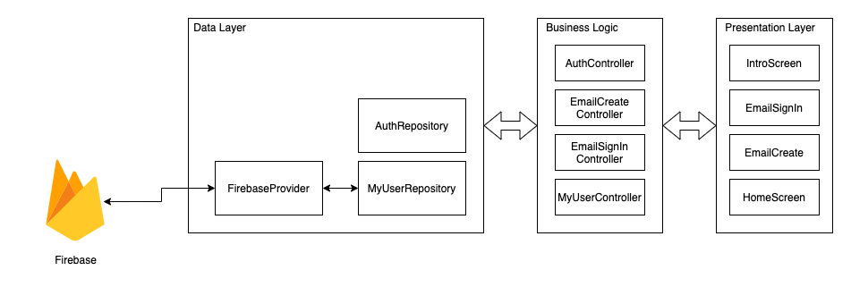
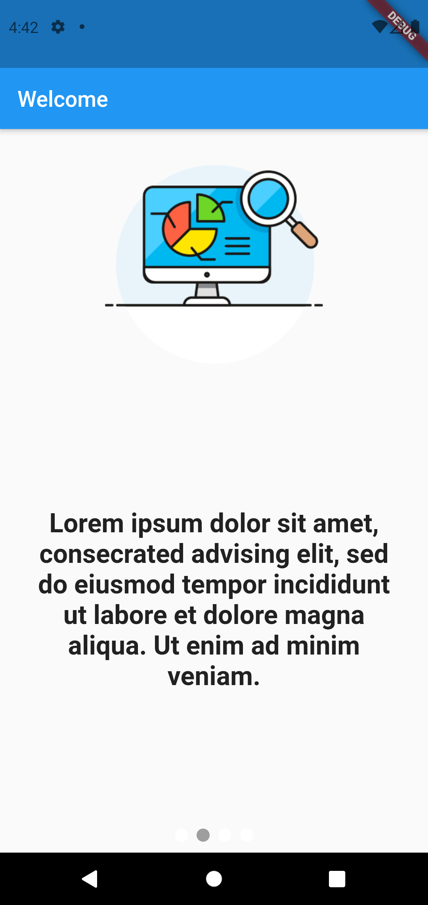

# Flutter simple firebase authentication with [GetX](https://pub.dev/packages/get)

Flutter Version: Stable 2.5.1

- Login with Google, Facebook, email & anonymously using [Firebase Authentication](https://firebase.google.com/products/auth)
- Simple CRUD to firestore Read & Write.
- Upload images to firebase storage
- Separate the app in multiple layers (presentation, business logic, data)
- Splash Screen
- Null Safety

# Video

# Architecture

# Workflow

# Screenshots

| Login screen                                    | Intro Screen                                    | Home Screen                                     |
|-------------------------------------------------|-------------------------------------------------|-------------------------------------------------|
|  |  |  |
