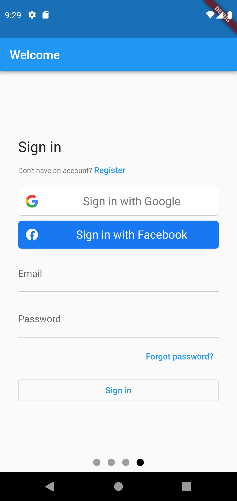

## Flutter: Simple CRUD with Firebase & Cubit

- [FlutterFire UI](https://pub.dev/packages/flutterfire_ui): Login with Google, Facebook & Email
- Manage the state with [Cubit](https://pub.dev/packages/flutter_bloc)
- Simple CRUD to firestore Read & Write.
- Upload and delete images to firebase storage
- Separate the app in multiple layers (presentation, business logic, data)
- Cubit tests

# Videotutorial (spanish)

# Workflow

# Architecture

# Screenshots

| Login screen                                    | Create or edit user                             | User list                                       |
|-------------------------------------------------|-------------------------------------------------|-------------------------------------------------|
|  |  |  |
