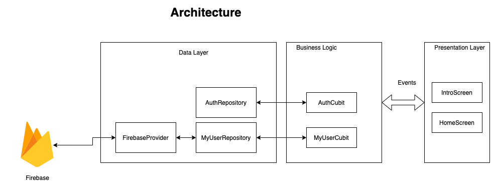
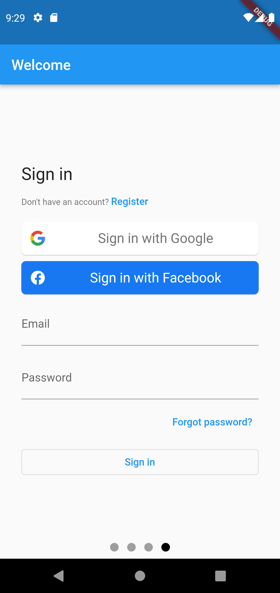
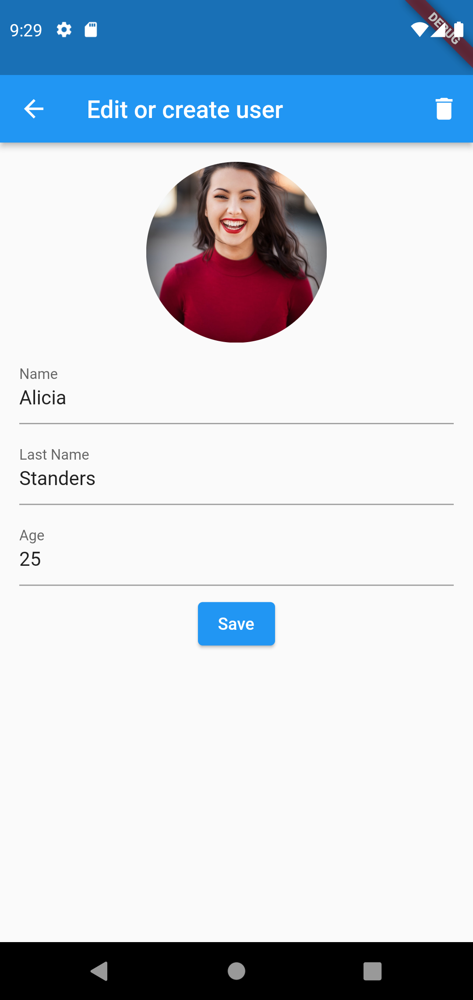

## Flutter: Simple CRUD with Firebase & Riverpod

- [FlutterFire UI](https://pub.dev/packages/flutterfire_ui): Login with Google, Facebook & Email
- Manage the state with [Riverpod](https://pub.dev/packages/flutter_riverpod)
- Simple CRUD to firestore Read & Write.
- Upload and delete images to firebase storage
- Separate the app in multiple layers (presentation, business logic, data)
- Cubit tests

# Videotutorial

# Architecture

[//]: # ()

# Workflow

[//]: # ()

# Screenshots

| Login screen                                    | Create or edit user                             | User list                                       |
|-------------------------------------------------|-------------------------------------------------|-------------------------------------------------|
|  |  |  |
