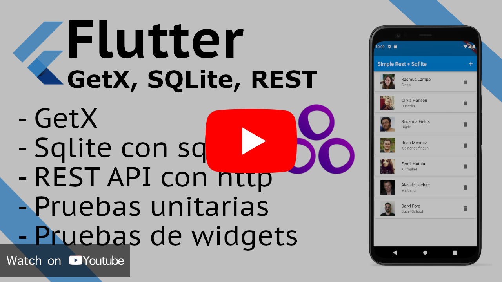
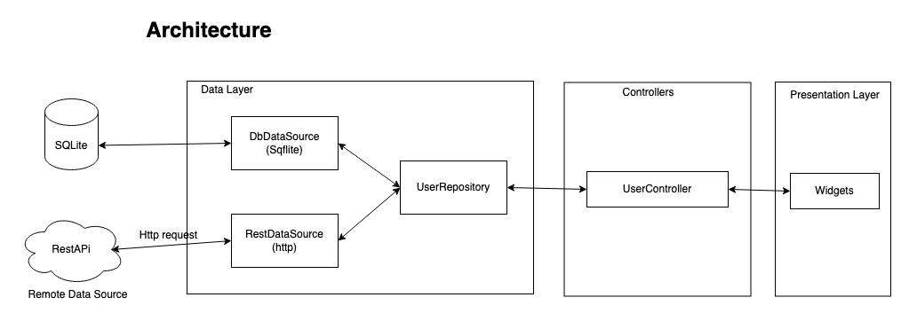

# Flutter simple firebase authentication with [GetX](https://pub.dev/packages/get)

Flutter Version: Stable 3.10.0

- Learn how to call a REST API with [http](https://pub.dev/packages/http)
- Save response data in SQLite with [sqflite](https://pub.dev/packages/sqflite)
- State management with [GetX](https://pub.dev/packages/get)
- Separate the app in multiple layers (presentation, business logic, data)
- Unit tests and widget tests
- Mock data with [Mockito](https://pub.dev/packages/mockito)

# Video

# Architecture

