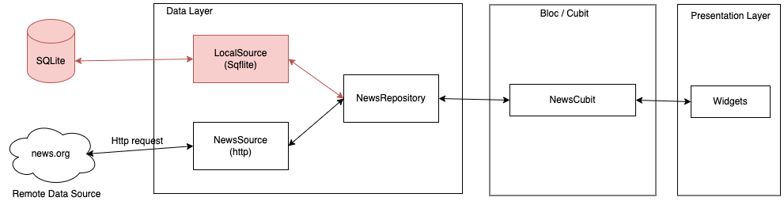

# Flutter Festival Taipei

## Simple News App using Cubit ([flutter_bloc](https://pub.dev/packages/flutter_bloc))

Working on flutter 3.29.0

- Learn how to use manage states using [cubit](https://pub.dev/packages/flutter_bloc)
- Separate the app in multiple layers (presentation, business logic, data)
- Make request to a Rest API using [http](https://pub.dev/packages/http)
- Unit test & widget test
- Handle exceptions

# Prerequisites

- Get an API key from [https://newsapi.org/](https://newsapi.org/)
- Add the API key in the `NewsSource` class

  ````
  class NewsSource {
    static const String _apiKey = 'Change to your own api key';
  ````

- Run the command `flutter pub run build_runner watch --delete-conflicting-outputs` to generate the
  code.

# Architecture

We separate in three layer:

- Presentation
- Business Logic
- Data: Repositories, Data sources.
  

# Screenshots

| Success Response                   | Handle ApiKey Invalid              |
|------------------------------------|------------------------------------|
|  |  |

# Youtube Video (English)

[](https://youtu.be/6l5fJ3JGL6A)